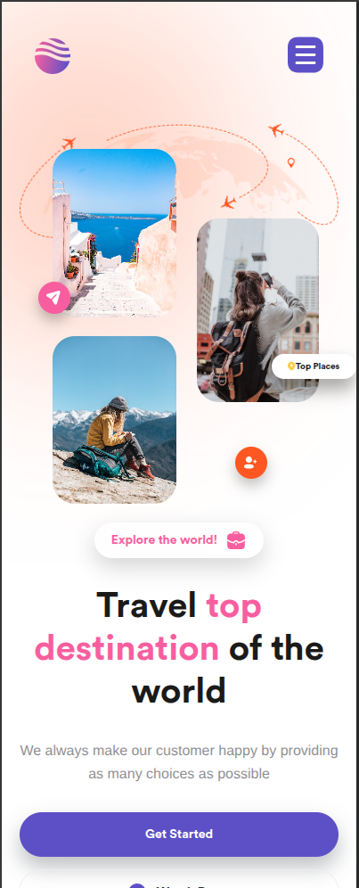
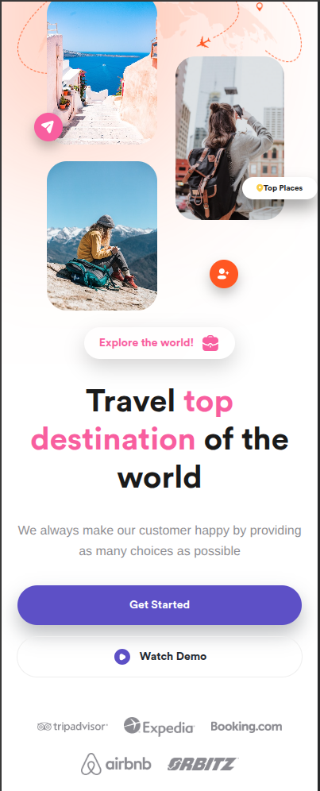
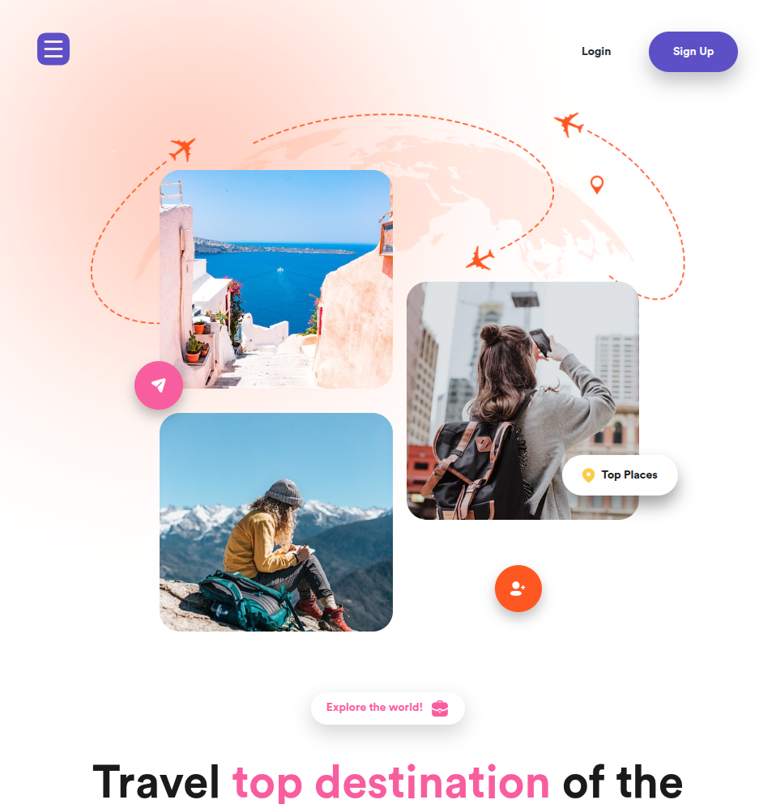

## Getting Started

### Prerequisites

-   **Node.js**: Version 18+ or 20+. You can download and install it from nodejs.org.
-   **npm**: Node.js package manager, which comes bundled with Node.js.

### Installing

To set up the project on your local environment, follow these steps:

1. **Clone the Repository**

    First, you need to clone the repository.

2. **nvm (Node Version Manager)**: If the required Node version 18+ is already installed and active, you can skip this step else you can use nvm (Node Version Manager). Here's how to use it:

    - **Switch Node Version**: If the required Node version is already installed, run:

    ```bash
    nvm use
    ```

    - **Install Node Version**: If the required Node version isn’t installed, you can install it by running:

    ```bash
    nvm install
    ```

    > **_Tip:_** If you don't have nvm installed, you can install it by following the instructions on [nvm-sh/nvm](https://github.com/nvm-sh/nvm).

    Alternatively, you can update Node.js directly by downloading the latest version from the official website: nodejs.org.

3. **Install the necessary dependencies using npm**

    ```bash
    npm install
    ```

4. **Run the Development Server**

    ```bash
    npm run dev
    ```

    The app will typically be available at http://localhost:3000, but check the terminal output for the exact URL.

    > **_NOTE:_** Note: If you want to change the server's port number, you can do so by modifying the **vite.config.js** file at the root level of the project:

    ```js
    server{
        port:<New Port>,
    }
    ```

5. **Build the Project**

    ```bash
    npm run build
    ```

    This command will generate the optimized files in the dist directory.

6. **Lint the Code**
   `bash
npm run lint
`
   <<<<<<< HEAD

### Design View

#### 1. Mobile View

<p align="left">
  
  
</p>

#### 2. Tablet View

<p align="left">
  
  
</p>

#### 3. Desktop View


=======
>>>>>>> d943d1c4aaf4edf33957c2482e322df0075856c4
